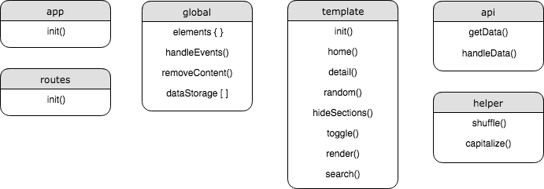

# Web App From Scratch
The course repo for 'Web App From Scratch'

[Live demo](https://viennam.github.io/wafs/week3/app)

## 🐕 Dog breeds
This client side single page web app shows a name list of all dog breeds, using the [Dog CEO API](https://github.com/ElliottLandsborough/dog-ceo-api) and [Routie](https://github.com/jgallen23/routie) for hash routing.

### Features
- Search for a breed
- Get pictures of a specific breed
- Get a random picture of a dog

## Structure

### Actor diagram

### Interaction diagram

## Dog API
[Dog CEO API](https://github.com/ElliottLandsborough/dog-ceo-api): over 20,000 images of dogs programmaticaly accessible by over 120 breeds.

## Best practices
- Don't use global variables/objects
- Declare variables at top of scope
- Use short clear meaningful names (English)
- Work in strict mode
- camelCase your code if(code != Constructor || CONSTANTS)
- Place external scripts at the bottom of the page
- Indent your code
- Commit often, push once

## Wishlist
- Add sub breeds
- Save / favorite / like / share breeds or pictures 
- Random picture of breed in list
- Translate breed list to Dutch
- Submit pictures

## Sources
- [Dog CEO API](https://github.com/ElliottLandsborough/dog-ceo-api)

- [Routie](https://github.com/jgallen23/routie)

- [Loader image](https://imgur.com/gallery/YbkBxYb)

## License
[MIT License](https://mit-license.org/)

